# hsl-web

The HeatSync Labs members and door system.

It holds the membership, the RFID cards, the certifications and the dues record,
and it is the only thing that talks to the door controller. It replaces a Rails
3.2 application running on Ruby 1.9.3, both of which stopped receiving security
patches around 2015.

Nothing here is deployed yet. Nothing in production has been touched.

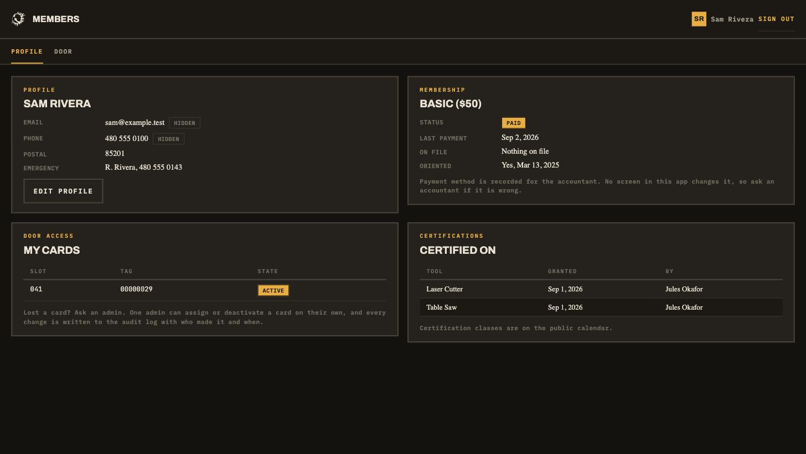

## Run the whole thing on your machine

Everything runs in Docker: Postgres, the API, the three apps behind Caddy, and a
mail catcher. You need Docker and nothing else. Node and pnpm are only needed if
you want to change the code.

```
git clone https://github.com/heatsynclabs/hsl-web
cd hsl-web
cp .env.example .env
make secrets
make up
make seed
```

Open **http://localhost:9080**. The password for every seeded account is
`heatsync`.

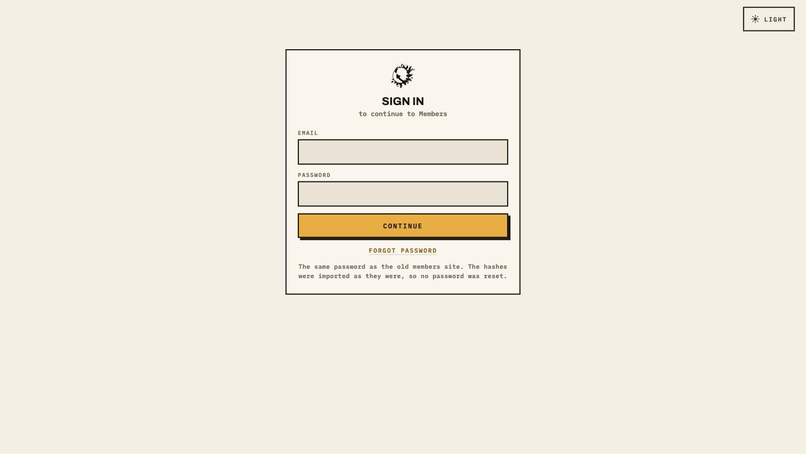

| Sign in as | Sees |
|---|---|
| `sam@example.test` | an ordinary member: own profile, own card, own certifications |
| `dana@example.test` | an admin: the directory, every member, the door, the audit log |
| `jules@example.test` | an instructor: grants and revokes certifications |
| `ari@example.test` | an accountant: records dues payments |

| URL | What |
|---|---|
| http://localhost:9080 | the members portal, and where you sign in |
| http://localhost:9080/signup | joining the lab |
| http://localhost:9080/admin | the admin portal, for `dana@example.test` |
| http://localhost:9080/space_api.json | the public status document |
| http://localhost:8026 | every email the system sent, including reset links |

Three apps, one session, all on one origin. `make reset` throws the database
away and rebuilds it; `make seed` fills it again. `make down` stops everything.

`make admin EMAIL=someone@example.org` makes an existing member an admin. A
fresh install needs it once, because every route that grants admin already needs
an admin.

## Run it against the real members database

The same stack with a copy of the old Rails database beside it. You need a
`pg_dump` custom format file. The runbook is
`docs/runbooks/import-the-members-database.md`; this is the short version.

```
cp members-backup.dump legacy/members.dump

make reset                       # an empty database for the import to write into
make legacy-restore              # restores the dump into a container
make import ARGS=--dry-run       # reads everything, reports, writes nothing
make import ARGS=--accept-orphans
```

The dry run refuses if anything needs a decision. On the production dump it
reports 31 members with no password, one card in a slot the reader cannot see,
and 67 rows belonging to members who no longer exist, and explains each one.

The import then reconciles both databases side by side and refuses to claim
success if the counts disagree:

```
  what                                        legacy  imported   skipped
  members                                       1061      1061         0
  credentials                                   1030      1030         0
  cards                                           64        64         0
  members with card access (permission 1)         63        63         0
  certifications                                  10        10         0
  certification grants                           415       414         1
  payments                                      8291      8290         1
  signed releases                                318       253        65
```

Everybody keeps the password they already had. The bcrypt hashes are copied
verbatim, so nobody resets anything.

`legacy/` is gitignored. Never commit a dump: it holds names, addresses,
emergency contacts and a record of who entered a building.

## The members portal

A member's own record, their cards, their certifications and their dues. The
door controls are the second tab.

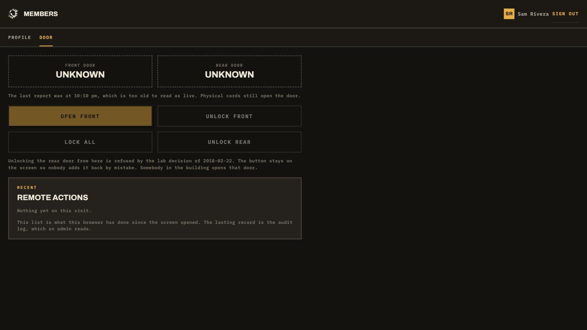

The door screen is honest about what it knows. When the door service has not
reported recently the tiles read Unknown, the controls are disabled rather than
queueing into silence, and the screen says physical cards still open the door.
Unlocking the rear door stays visible and stays refused, with the 2018 lab
decision written beside it, so nobody adds it back by mistake.

Every screen has a theme toggle. Light is the default and the choice is
remembered per browser.

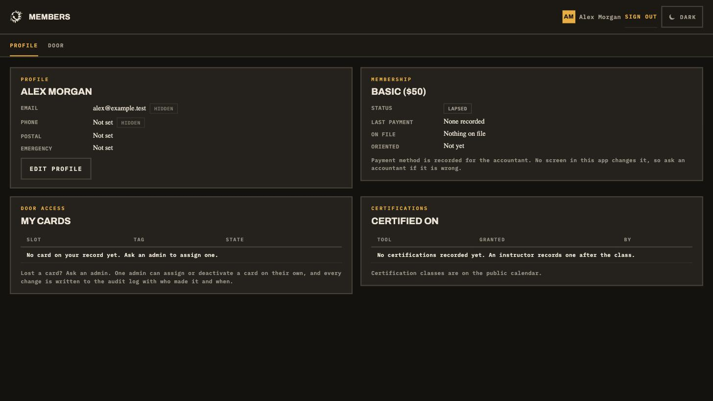

Forgetting a password is a real path, not a dead link. The email arrives in the
mail catcher at http://localhost:8026, and the link lands here.

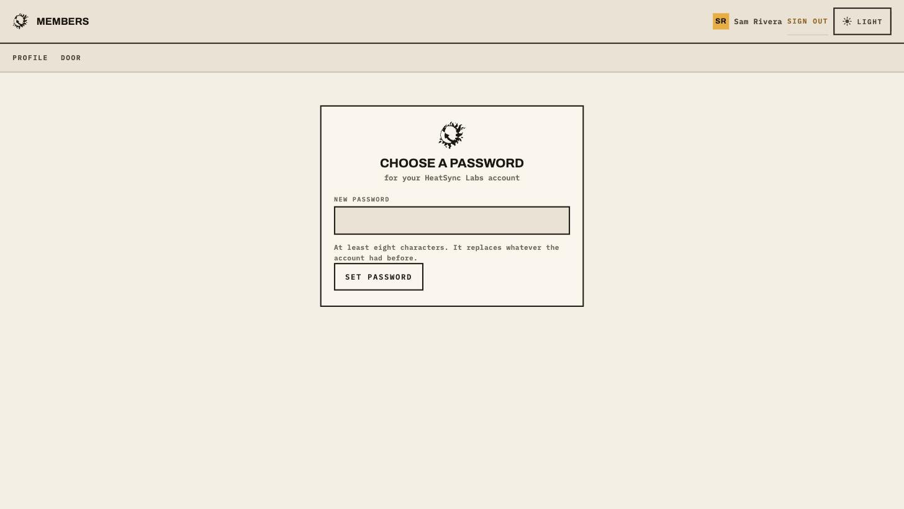

## Joining

Five steps, and nothing is sent to the lab until the last one.

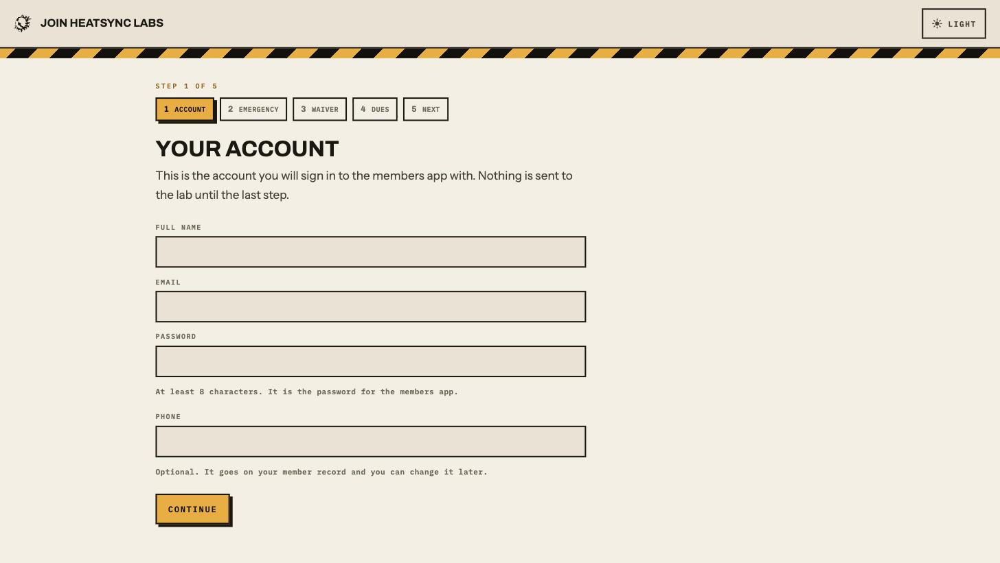

The release says what it is and what it is not.

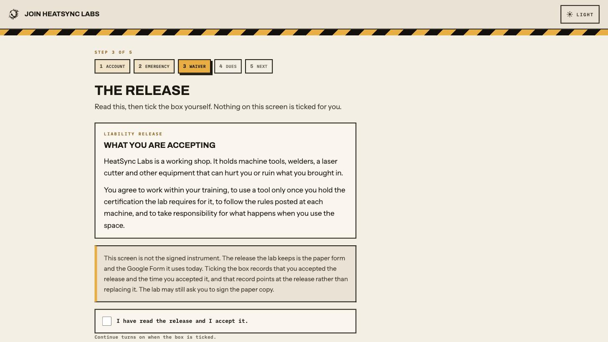

The tiers are the ones the lab actually uses. The app never takes a card number.

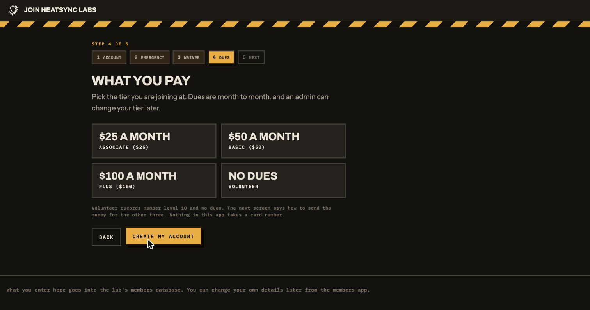

The last screen says what happens next, and names no timeline the lab has not
agreed on.

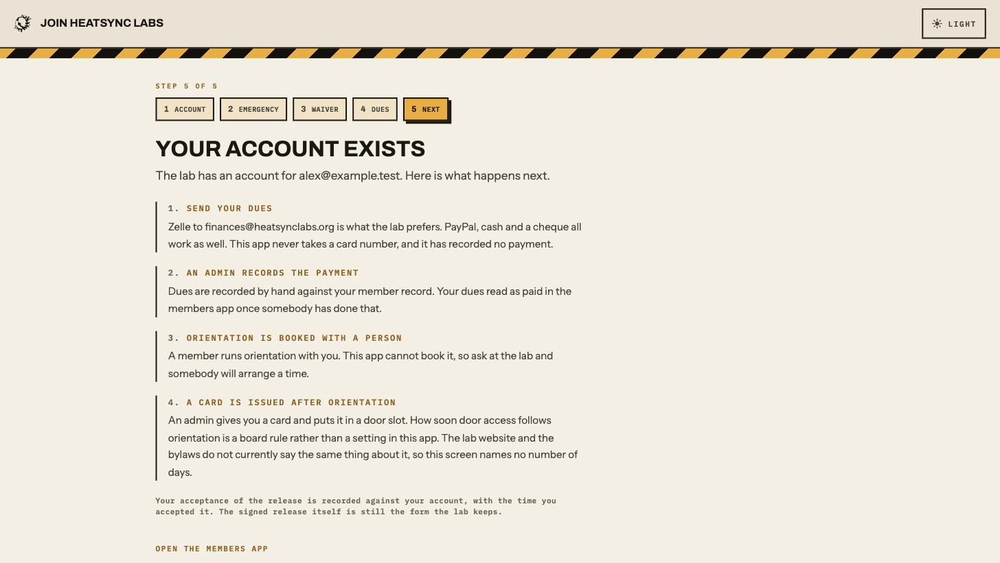

## The admin portal

The directory, with dues status and card slot per member.

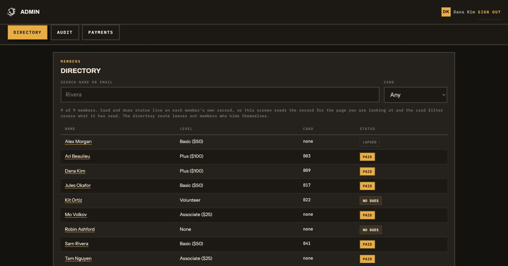

One member's record. Card access is separated from everything else and asked
twice, because it is a building key.

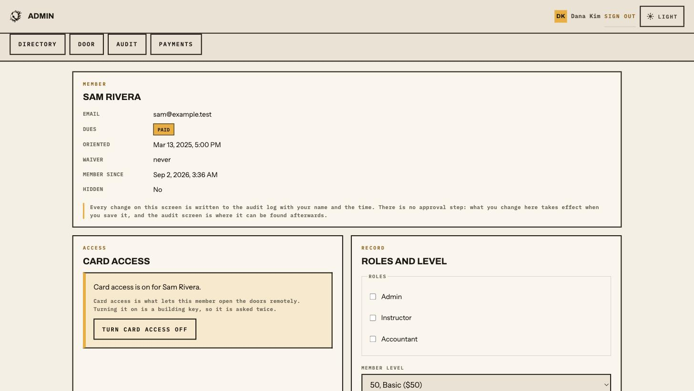

**Enrolling a card** is the screen worth looking at. The old process was five
steps, three of which were arithmetic: hold an unissued card to the reader, open
the door log, find the refused read, work the number out by hand from two rows,
then create the card and push the whole table.

The controller splits a 32 bit tag across two 16 bit log entries. The door
service puts it back together, so a card held to the reader appears here as a
row to assign.

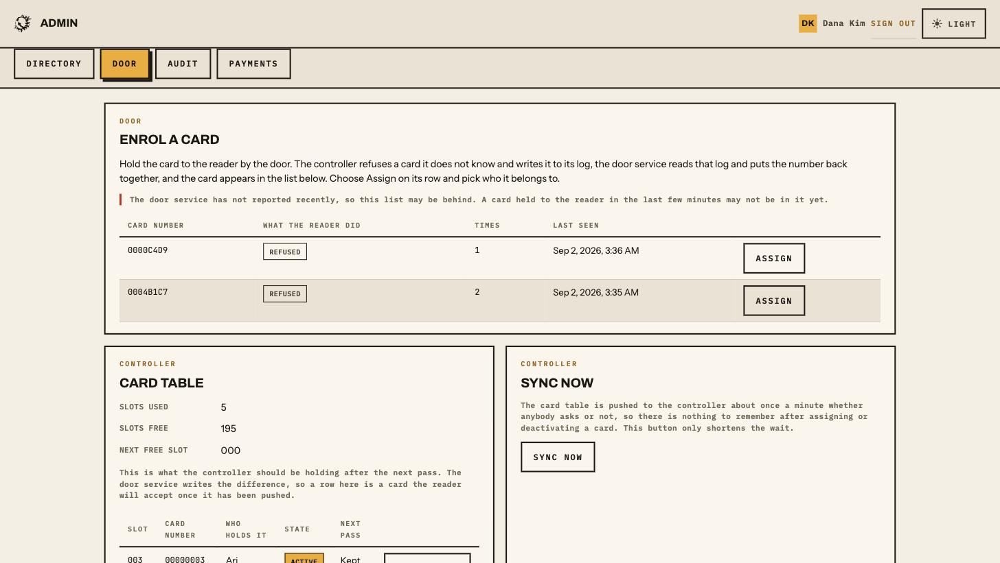

The card table below it shows what the controller should be holding, which rows
the next pass will clear and why, and how many slots are left of the 200 the
firmware has.

Recording dues, for an accountant.

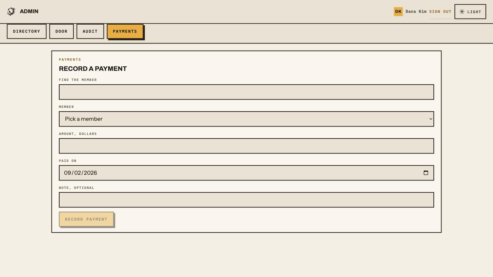

There is no approval queue. Any admin acts immediately and every privileged
change is written to a log that cannot be edited, deleted or truncated, enforced
by the database rather than by a screen.

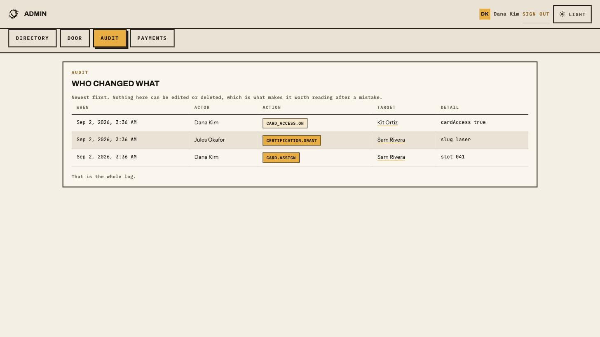

The apps refuse in words rather than status codes. This is the admin portal
opened by a member who is not an admin.

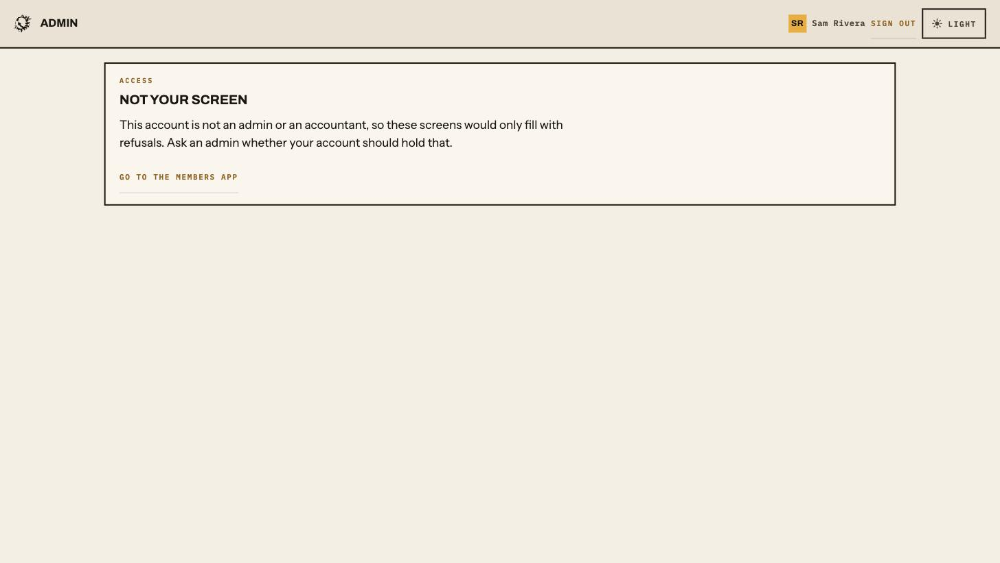

## Working on the code

The stack above serves built apps. For hot reload, run the database and API in
Docker and the apps on the host:

```
echo 'COMPOSE_FILE=compose.yaml:compose.dev.yaml' >> .env
docker compose up -d db api mail
pnpm install
pnpm dev
```

```
pnpm check      # lint, typecheck, test
```

645 tests. The ones that need a database read `DATABASE_URL` and skip with a
message when it is not set. The door service tests run against a fake controller
that speaks the real wire protocol, so they need no hardware.

Adding something members sign in to is `docs/build-an-app.md`. The short version
is to serve it on the members hostname, where the session already works, which
the admin portal demonstrates.

## What is in here

```
apps/members     profile, cards, certifications, dues, door controls, sign in
apps/signup      join: account, waiver, tier, what happens next
apps/admin       directory, member detail, door, audit, payments

packages/ui          the design system: tokens, the marks, the components
packages/schema      the tables, the request and response schemas, the types
packages/api-client  a typed client over those schemas

services/api     Hono and better-auth. The only thing that writes to Postgres.
services/door    the door controller adapters and the reconcile loop.
                 Runs on the lab LAN. Holds the controller password.

docs/            architecture, the verified legacy facts, operations, decisions
infra/           the Caddy config and the lab host's compose file
tools/           backup, restore, the restore drill, the import, the voice check
```

TypeScript throughout. One pnpm workspace, one Postgres.

## The two things that must not break

**The door keeps working.** The controller holds its own card table in EEPROM.
When this system, the network or the internet is down, physical cards still open
the building. Only remote control and syncing pause.

**One URL cannot change.** The lab website and an ESP8266 status LED both read
`/space_api.json`. Its payload is a contract with things outside this
repository, and parity gets proven on a test hostname before the hostname moves.

## Before contributing

Read `CONTRIBUTING.md`. It is short and it binds. The parts people miss most
often: no em dashes, no emoji, no model attribution in commits, and comments
that explain why rather than what.

`docs/legacy-system.md` records what the production database and the Rails and
firmware sources actually say, checked against a restored dump rather than taken
from the planning documents. Where any other document disagrees with it, it wins.

`HANDOFF.md` is the current state, what an eight way audit found, and what is
still open. `docs/operations.md` covers deploying to a real host.

## Licence

Apache 2.0. `ATTRIBUTIONS.md` lists the dependencies and the borrowed patterns,
including the earlier HeatSync work this builds on, and the licence questions
that are still open.
